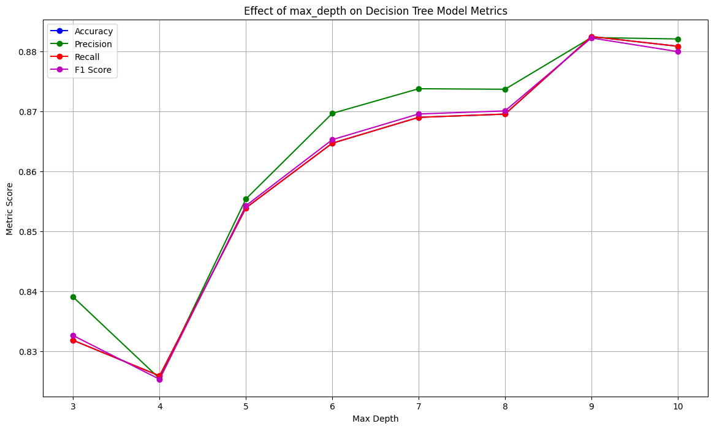
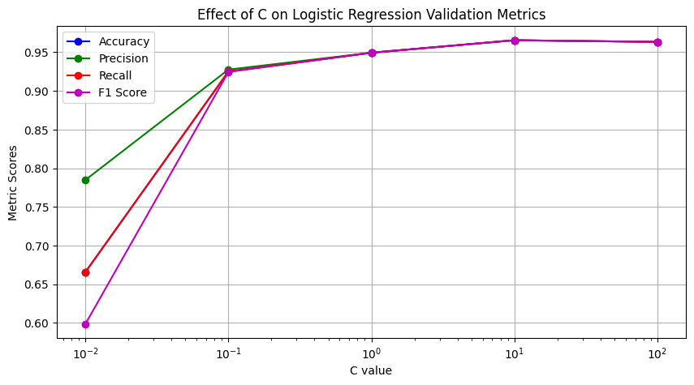
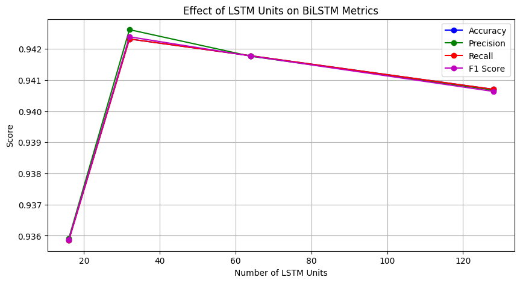

# Fake News Detection: Truth Seekers

## Project Overview

**Fake News Detection** is the process of identifying misleading or false information distributed via digital platforms such as websites, social media, and news agencies. The goal of this project is to build a machine learning system that can classify whether a news article is **reliable** or **potentially fake**.

This is a supervised text classification task, where the model learns from labeled news articles and predicts whether new articles are unreliable. The dataset contains article titles, full texts, authors, and reliability labels.

## Dataset

A full dataset with the following attributes:
- id: unique id for a news article
- title: the title of a news article
- author: author of the news article
- text: the text of the article; could be incomplete
- label: a label that marks the article as potentially unreliable
  - 1: unreliable
  - 0: reliable

## Data Cleaning & Preprocessing

We performed standard Natural Language Processing (NLP) techniques:
- Lowercasing and punctuation removal
- Tokenization
- Stopword removal (using NLTK)
- TF-IDF vectorization for traditional models
- Sequence padding and tokenization for deep learning models

## Models Used

### 1. Decision Tree  
A baseline model using scikit-learn's `DecisionTreeClassifier`.

### 2. Logistic Regression  
A linear model using `TfidfVectorizer` features to classify articles.

### 3. Bi-Directional LSTM  
A deep learning model using Keras' `Embedding`, `Bidirectional(LSTM)`, and `Dense` layers to capture long-term dependencies in text.

## Tools and Libraries

### NLP and Preprocessing
- `nltk` – tokenization, stopword removal
- `re` – text cleaning
- `pandas` – data manipulation
- `TfidfVectorizer` – text vectorization

### Machine Learning
- `scikit-learn` – Decision Tree, Logistic Regression, train-test split, metrics
- `tensorflow.keras`:
  - `Sequential`, `Embedding`, `LSTM`, `Bidirectional`, `Dense`
  - Model training and evaluation

### Visualization
- `matplotlib.pyplot` – accuracy and loss plots

## Results & Insights

- Logistic regression achieved higher precision and recall than the decision tree baseline.
- The BiLSTM model significantly outperformed both in F1-score, showing the importance of context-aware representations in fake news detection.